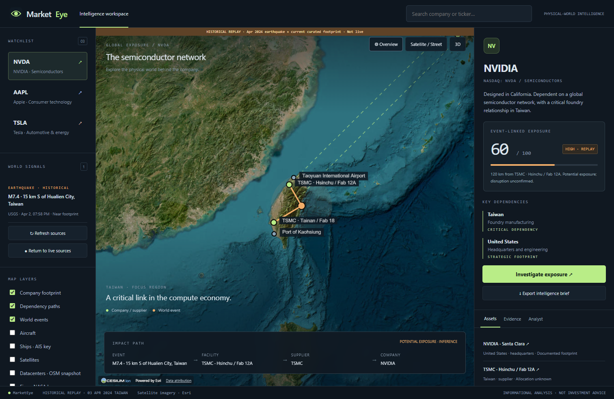

# MarketEye

**Search a company. See where it depends on the world.**

[](https://github.com/armanbabazadeh6/MarketEye/actions/workflows/ci.yml)

MarketEye is a geospatial market-intelligence workspace connecting public companies to physical assets, supplier campuses and nearby world events. A Cesium globe, deterministic exposure model and evidence-driven investigation tour make the reasoning visible.



*Actual application screenshot. The amber banner identifies the April 2024 earthquake replay; this is not a live risk claim.*

## Start locally

Use **Node.js 24.14+ within 24.x**, or **Node.js 26.x**, and a browser with WebGL enabled. Node 24 is the recommended test runtime because upstream allocation budgets are calibrated on it.

```bash
git clone https://github.com/armanbabazadeh6/MarketEye.git
cd MarketEye
npm ci
npm run dev
```

Open the URL printed by Vite, normally **http://localhost:4173**. No API keys are needed for the core globe, USGS earthquakes, weather estimates, local analyst tools or historical replay. Internet access is required for live sources and map imagery.

```bash
npm run build          # production client bundle
npm run preview        # serve built client with the retained provider proxies
npm run test:marketeye # focused MarketEye domain tests
npm test               # full retained upstream + MarketEye suite
npm run qa:marketeye   # browser QA; start the dev server first
```

The default is a local application. **A static-only host does not run the weather, aircraft, vessel or AI proxies.** Do not treat Vite's local development server as a hardened public production service. Production hosting needs an authenticated server deployment of the relevant adapters, appropriate provider terms, rate limits and secret management.

## The 30-second flagship demo

1. Search **NVDA**. The map moves to Taiwan and shows documented TSMC campuses, NVIDIA headquarters and contextual logistics infrastructure.
2. Read the live source coverage and event-linked screening score. Zero can mean no intersecting events in the available dataset; missing coverage remains unknown.
3. Select **Explore Taiwan 2024 replay** for a repeatable demonstration using the real USGS M7.4 Hualien event.
4. Click the earthquake to inspect distance, score factors, asset candidates and the original source.
5. Press **Investigate exposure**. Follow the camera through the event and supplier campuses, then read or export the intelligence brief.
6. Open **Analyst**, ask **Why Taiwan?**, and then **Show me**. The latter executes a globe action.

The replay evaluates a historical event against the **current curated footprint**, one hour after the event for freshness scoring. It is not a reconstruction of what was known in 2024, proof of realized damage, or a backtest of financial returns.

## What works

- NVIDIA, Apple and Tesla search and watchlist selection.
- A distinct terminal interface with source evidence, company assets and geographic dependency paths.
- Keyless satellite imagery, street-map fallback, camera navigation and optional photorealistic 3D.
- Sourced JSON company datasets with explicit relationship types and approximate-coordinate policy.
- Live USGS earthquake normalization and per-campus Open-Meteo model conditions through the upstream weather proxy.
- Explainable deterministic event-to-asset exposure screening, confidence and freshness factors.
- Event → facility → supplier → company impact graphs and corresponding geographic connections.
- Cancellable investigation tours, evidence timeline and downloadable Markdown briefs.
- Local structured analyst tools; optional OpenAI function-call routing with server-side credentials.
- Optional upstream aircraft, ships, satellites, datacenters, fires and submarine-cable layers. Missing keys/providers display unavailable or degraded states.
- Responsive layout, keyboard-accessible controls and graceful total-source failure behavior.


## How scoring works

Each qualifying asset-event pair receives:

```text
100 × event severity × proximity × dependency importance
    × evidence confidence × freshness

proximity = max(0, 1 − distance / screening radius)
importance = 0.5 × asset + 0.3 × dependency + 0.2 × supplier
confidence = minimum(event, location, supplier confidence)
freshness = 2 ^ (−age / half-life)
```

Earthquake half-life is 24 hours; weather half-life is six hours. Earthquake screening radius is `magnitude² × 8 km`, bounded to 50–700 km; weather uses 75 km. The company score is the maximum asset-event score, avoiding inflated scores from duplicated campus records. Thresholds are low <25, medium 25–49, high 50–74 and critical ≥75.

These are **transparent screening heuristics**, not statistically calibrated probabilities, seismic damage models, revenue weights or financial forecasts. Regional concentration is described qualitatively. Ports and airports labeled `context-only` do not contribute to the score. No LLM assigns the numbers. See [engine](src/exposure/engine.js) and [tests](src/exposure/engine.test.mjs).

## Evidence and data sources

| Source | Use | Important boundary |
| --- | --- | --- |
| [NVIDIA FY2025 sustainability report](https://images.nvidia.com/aem-dam/Solutions/documents/NVIDIA-Sustainability-Report-Fiscal-Year-2025.pdf) | TSMC foundry relationship | Does not establish product allocation to a specific fab |
| [TSMC fab directory](https://www.tsmc.com/english/aboutTSMC/TSMC_Fabs) | Supplier campus context | Approximate campus coordinates, not production-line locations |
| [Apple FY2022 supplier list](https://www.apple.com/tw/supplier-responsibility/pdf/Apple-Supplier-List.pdf) | Historical supplier relationship | Explicitly historical; requires current revalidation |
| Tesla official factory pages and investor update | Factory footprint | No inferred utilization, capacity shares or current model mix |
| [USGS](https://earthquake.usgs.gov/earthquakes/feed/v1.0/geojson.php) | M2.5+ events from the last 24 hours | Proximity does not establish damage or shutdown |
| [Open-Meteo](https://open-meteo.com/en/docs) | Current model-estimated weather at mapped campuses | Not an official weather alert or a facility observation |
| Taiwan port and airport operators | Nearby infrastructure | No verified NVIDIA shipment attribution |

Every curated asset and supplier relationship links to a public source. Source retrieval status and event timestamps remain separate. Provider requests are bounded, retried once, coalesced and cached for five minutes; a failed refresh preserves the last successful in-session snapshot as stale. No successful snapshot means unavailable.

Read [DATA_SOURCES.md](DATA_SOURCES.md) for retained upstream datasets and their terms. Sources have independent availability and licensing constraints.

## Analyst and optional configuration

Copy `.env.example` to `.env` to add optional credentials. Never commit `.env`.

| Variable | Purpose |
| --- | --- |
| `OPENAI_API_KEY` | Optional server-side analyst credential |
| `MARKETEYE_ANALYST_MODEL` | Explicit Responses API model ID supporting function tools; choose one available in your account |
| `CESIUM_ION_TOKEN` | Optional ion imagery / terrain and photorealistic route; client-visible, restrict appropriately |
| `GOOGLE_MAPS_API_KEY` | Optional direct photorealistic 3D; client-visible, restrict appropriately |
| `AISSTREAM_API_KEY` | Optional live vessel layer |
| `FIRMS_MAP_KEY` | Optional NASA active-fire layer |

Core usage incurs no model calls. With both analyst settings configured, the model selects one validated MarketEye tool through the [Responses function-calling API](https://developers.openai.com/api/docs/guides/function-calling). Actual tool output supplies the evidence and scores. The UI labels AI routing versus local fallback; provider failure never pretends that an action succeeded. This MVP uses one bounded tool-routing call, not unrestricted autonomous research or an unsourced chatbot. The model is never allowed to add company infrastructure to the catalog.

Supported tools include company exposure, locations, suppliers, nearby events, company comparison, globe display, investigations and brief generation. Comparison uses the same available snapshot and flags uneven weather coverage; it is not a revenue-weighted ranking. Optional WebMCP registration exposes read, navigation and investigation actions in supporting browsers; unsupported browsers continue normally.

## Architecture

```text
data/companies/       Sourced NVDA, AAPL, TSLA records
data/events/          Provenanced historical USGS replay
src/companies/        Catalog, contracts and validation
src/events/           Normalization adapters
src/providers/        Cache, retry and source state
src/exposure/         Pure deterministic screening engine
src/impact/           Explicit evidence graph
src/analyst/          Tool contracts, investigation planner and brief
src/globe/            MarketEye presentation over upstream Cesium infrastructure
src/markets/          Independent market-pricing provider interface
src/ui/              Terminal styles and browser tool registration
server/              Optional server-side analyst endpoint
src/marketeye.js      Application state and UI orchestration
```

The original map-stack controller, render governor, data-layer manager, earthquake validator, weather proxy, attribution and optional spatial layers are reused. The retained upstream annotations, camera verbs, tracking and voice infrastructure remain in the repository for extension. The old simulator shell is archived as a regression fixture in `docs/upstream-index.html`; legacy markup tests target that fixture while browser QA targets the actual MarketEye application.

## Validation and limitations

Browser QA covers live loading, search, unsupported queries, replay, score explanations, analyst globe actions, investigation completion/cancellation, mobile overflow and total provider outage. Tests exercise distance calculations, scoring, catalog validity, provider failure/recovery, graph edges, tool validation and investigation cancellation. CI retains Linux Node 24/26 and Windows onboarding checks. Node 24 additionally runs upstream calibrated allocation tests.

Current limitations are deliberate and visible:

- Only three companies, with a small curated footprint; supplier coverage is not exhaustive.
- Current Apple supplier evidence is incomplete; the bundled supplier relationship is explicitly historical.
- No verified facility operating-status, shipment attribution, port shutdown or inventory feed.
- No news/geopolitical-event correlation, exchange-grade market quotes or monetary impact estimation yet.
- Optional spatial layers are visual context; vessel/aircraft activity is not automatically treated as evidence of a company disruption.
- Optional paid AI and photorealistic providers require your credentials; live paid-provider calls are not part of keyless validation.
- The local Vite proxy architecture requires production server work before public deployment.

For the next development session, start with [CONTINUATION.md](docs/CONTINUATION.md) and the original [product brief](docs/MARKEYE_BRIEF.md).

## Attribution and license

Built by Arman Babazadeh on [Bilawal Sidhu's God's Eye View](https://github.com/bilawalsidhu/gods-eye-view), upstream commit `c7ef01827d7f12407180bc77e3955736c00cd749`. The upstream Git history and MIT license are preserved. See [original README](docs/UPSTREAM_README.md) and [LICENSE](LICENSE).

The MIT license covers code, **not all bundled third-party data or models**. TeleGeography cable data is CC BY-NC-SA 3.0 and is not licensed for commercial use. OpenStreetMap extracts carry ODbL requirements. Map imagery, weather and other live providers have separate terms. Preserve visible attribution and review [DATA_SOURCES.md](DATA_SOURCES.md) before redistribution or commercial use.

**MarketEye provides informational analysis only, not investment advice.**
