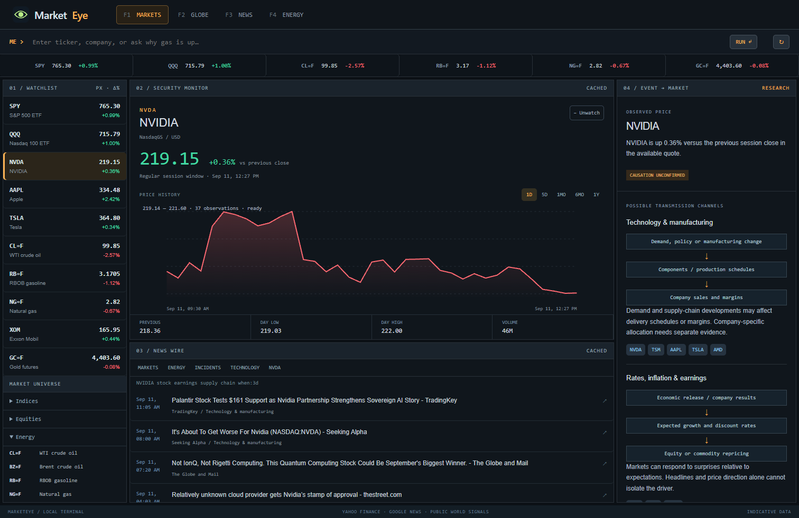
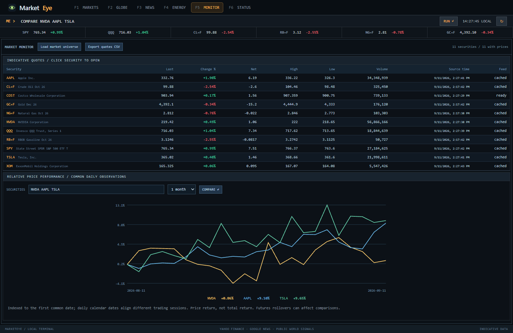
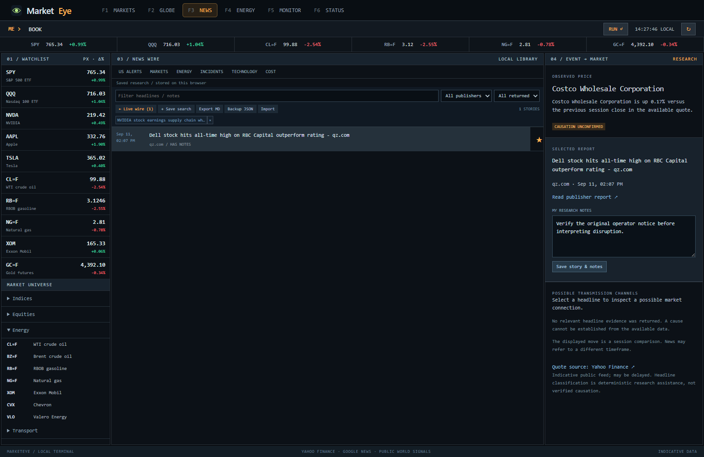
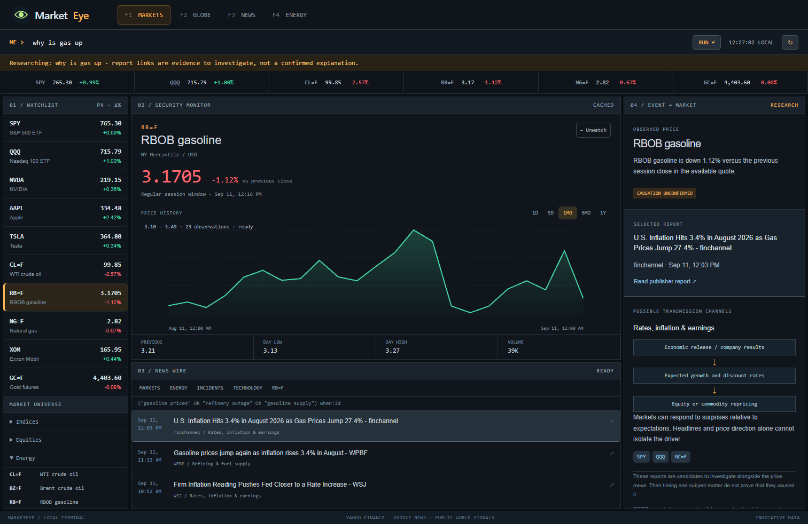
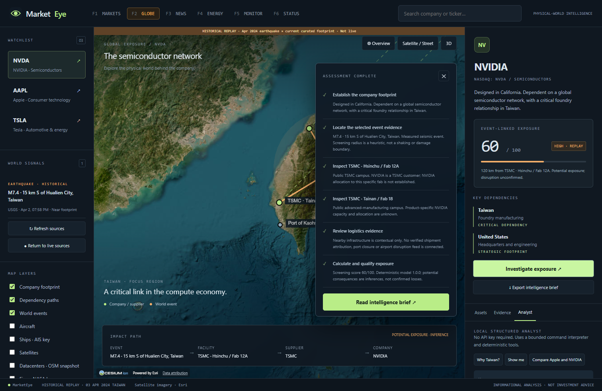

# MarketEye

**Your market terminal. Prices, headlines, and the world behind the move.**

[](https://github.com/armanbabazadeh6/MarketEye/actions/workflows/ci.yml)

I'm Arman Babazadeh, and MarketEye is my personal market-intelligence project: a terminal-style workspace for checking stocks and commodities, reading current news, and investigating how real-world events could affect companies. It runs on your computer, with an amber command bar, a persistent watchlist, price charts, an energy desk, and a 3D supply-network globe.



*Actual application screenshot; prices and headlines change. MarketEye is an independent open-source project, not affiliated with Bloomberg. The geospatial foundation reuses God's Eye View, credited below.*

## Start locally

Use **Node.js 24.14+ within 24.x**, or **Node.js 26.x**, and a browser with WebGL enabled. Node 24 is the recommended test runtime because upstream allocation budgets are calibrated on it.

```bash
git clone https://github.com/armanbabazadeh6/MarketEye.git
cd MarketEye
npm ci
npm start
```

**Windows:** double-click `Start-MarketEye.cmd`. It installs dependencies on the first run and opens a standalone Edge app window when Edge is installed, or your default browser otherwise. Keep the terminal process open; Ctrl+C stops the server. Subsequent launches reuse an existing MarketEye server. Node must be installed first.

`npm start` opens **http://127.0.0.1:4173** and binds to your computer's loopback interface. No API keys are needed for market quotes, headlines, the core globe, USGS earthquakes, weather estimates, local analyst tools or historical replay. Internet access is required for providers and map imagery. Set `MARKETEYE_NO_OPEN=1` to start without opening a browser.

```bash
npm run build          # production client bundle
npm run preview        # serve built client with the retained provider proxies
npm run test:marketeye # focused MarketEye domain tests
npm test               # full retained upstream + MarketEye suite
npm run qa:marketeye   # browser QA; start the dev server first
npm run qa:terminal    # real quote/news, chart, gas question, mobile and outage checks
npm run qa:research    # saved research, notes, comparisons, commands and mobile
npm run qa:integrated  # official alerts, regional links, dossiers, analyst and tours
```

The default is a local application. **A static-only host does not run the weather, aircraft, vessel or AI proxies.** Do not treat Vite's local development server as a hardened public production service. Production hosting needs an authenticated server deployment of the relevant adapters, appropriate provider terms, rate limits and secret management.

## Use the terminal

| Desk | What to do |
| --- | --- |
| **F1 Markets** | Enter `NVDA`, `AAPL`, `TSLA`, `MSFT`, or another valid Yahoo symbol. Inspect session change, select a chart range, and add it to your watchlist. |
| **F2 Globe** | Explore the curated NVIDIA, Apple and Tesla footprints, public world events and investigation tours. |
| **F3 News** | Browse Markets, Energy, Incidents or Technology. Enter a question or place in the command bar to search current headlines. |
| **F4 Energy** | Start with crude oil and the energy wire; switch to `BZ=F`, `RB=F`, or `NG=F` in the watchlist or universe. |
| **F5 Monitor** | Sort quote columns, load the market universe, export CSV, and compare two to four securities over common daily observations. |
| **F6 Status** | Inspect provider availability, original source timestamps, retrieval times and stale states. |

Try **“why is gas up”**, **“natural gas prices”**, or **“Houston refinery fire”**. The first selects gasoline futures and related reports. The terminal checks the actual available price direction—even when the question assumes a rise—and shows possible economic transmission channels. Select a headline to open its publisher report, inspect related securities, or locate a recognized region on the globe.

Watchlists persist in your browser. Quotes refresh every minute; news refreshes every three minutes while the market desk is visible. Charts support 1D, 5D, 1MO, 6MO and 1Y, with pointer inspection. SPY, QQQ and DIA are ETFs, not the underlying index levels.

### Command line

Press `/` to focus the command line. Up/down recalls recent commands. `HELP` opens the full reference.
Type a company name to fetch symbol suggestions, including exchange labels, then choose the intended security. Ticker symbols can also be entered directly.

```text
GP NVDA 6mo                         Historical price chart
NEWS Houston refinery fire          Search recent reporting
COMPARE NVDA AAPL TSLA               Common-date price performance
GEO NVDA                            Curated geographic footprint
INV AAPL                            Geographic evidence tour
ANALYST Why is NVIDIA exposed to Taiwan?
BRIEF NVDA                          Export a combined research dossier
BOOK                                Saved research library
STATUS                              Source health
```



### News and research notebook

The newsroom accepts up to 100 returned headlines per search, filters by text, publisher and publication age, and supports saved searches. Use `☆` to retain a story, select it to add your notes, and open **Saved stories** to revisit your research. Notes remain user-authored and separate from provider facts. The library supports up to 200 stories within a portable size limit.

**Backup JSON** exports the complete library; **Import** merges a backup by story URL. **Export MD** exports the currently filtered research. The data lives in this browser on this computer—back it up before clearing browser storage or moving computers. Command history and watchlists are also local. Browser storage failures are reported; unreadable research is preserved for recovery rather than overwritten.



**US alerts** loads active National Weather Service alerts with Severe or Extreme CAP severity. The detail pane retains forecast certainty, urgency, onset, expiry and original alert text. It does not treat a flood watch as observed damage. Some alerts have no published polygon and therefore no map point. Published polygon centers are approximate reference points, not incident coordinates. Official alerts are separate from the existing model-weather exposure score.

For recognized regions in news, MarketEye screens the three curated company footprints within 250 km, excludes context-only infrastructure, and links the underlying relationship sources. A location match does not verify a closure, shipment allocation, revenue loss or price driver.

`BRIEF NVDA` retrieves a quote, news and curated geographic evidence and exports one timestamped Markdown dossier. It preserves unavailable/stale states and keeps possible transmission channels separate from source facts.



**Data boundaries:** Yahoo's public chart endpoint is an unofficial, indicative source that may be delayed or unavailable. It is not an exchange-grade quote service. Google News supplies headline links, not verified facility status or full article reporting. The event-to-market engine uses transparent keyword rules; it does not prove why an asset moved. RBOB gasoline futures are wholesale fuel contracts, not local pump prices. Open the original reporting and operator notices to verify a closure or incident.

## Explore a company on the globe

1. Open **F2 Globe** and search **NVDA**. The map moves to Taiwan and shows documented TSMC campuses, NVIDIA headquarters and contextual logistics infrastructure.
2. Read the live source coverage and event-linked screening score. Zero can mean no intersecting events in the available dataset; missing coverage remains unknown.
3. Select **Explore Taiwan 2024 replay** for a repeatable demonstration using the real USGS M7.4 Hualien event.
4. Click the earthquake to inspect distance, score factors, asset candidates and the original source.
5. Press **Investigate exposure**. Follow the camera through the event and supplier campuses, then read or export the intelligence brief.
6. Open **Analyst**, ask **Why Taiwan?**, and then **Show me**. The latter executes a globe action.

The replay evaluates a historical event against the **current curated footprint**, one hour after the event for freshness scoring. It is not a reconstruction of what was known in 2024, proof of realized damage, or a backtest of financial returns.

## What works

- Public stock, ETF, commodity futures and Bitcoin quotes with timestamps, session comparisons and historical charts.
- Persistent custom watchlist, searchable news, publisher links, energy research and incident triage.
- Local desktop-style launcher and keyboard function-key navigation.
- Persistent research notes, saved searches, JSON backup/import and Markdown dossiers.
- Sortable market monitor, quote CSV export and common-date price comparisons (not dividend-adjusted total returns).
- Official NWS alerts and regional news-to-company footprint screening, without adding inferred incidents to the risk score.
- NVIDIA, Apple and Tesla search and watchlist selection.
- A distinct terminal interface with source evidence, company assets and geographic dependency paths.
- Keyless satellite imagery, street-map fallback, camera navigation and optional photorealistic 3D.
- Sourced JSON company datasets with explicit relationship types and approximate-coordinate policy.
- Live USGS earthquake normalization and per-campus Open-Meteo model conditions through the upstream weather proxy.
- Explainable deterministic event-to-asset exposure screening, confidence and freshness factors.
- Event → facility → supplier → company impact graphs and corresponding geographic connections.
- Cancellable investigation tours, evidence timeline and downloadable Markdown briefs.
- Local structured analyst tools; optional OpenAI function-call routing with server-side credentials.
- Optional upstream aircraft, ships, satellites, datacenters, fires and submarine-cable layers. Missing keys/providers display unavailable or degraded states.
- Responsive layout, keyboard-accessible controls and graceful total-source failure behavior.



## How scoring works

Each qualifying asset-event pair receives:

```text
100 × event severity × proximity × dependency importance
    × evidence confidence × freshness

proximity = max(0, 1 − distance / screening radius)
importance = 0.5 × asset + 0.3 × dependency + 0.2 × supplier
confidence = minimum(event, location, supplier confidence)
freshness = 2 ^ (−age / half-life)
```

Earthquake half-life is 24 hours; weather half-life is six hours. Earthquake screening radius is `magnitude² × 8 km`, bounded to 50–700 km; weather uses 75 km. The company score is the maximum asset-event score, avoiding inflated scores from duplicated campus records. Thresholds are low <25, medium 25–49, high 50–74 and critical ≥75.

These are **transparent screening heuristics**, not statistically calibrated probabilities, seismic damage models, revenue weights or financial forecasts. Regional concentration is described qualitatively. Ports and airports labeled `context-only` do not contribute to the score. No LLM assigns the numbers. See [engine](src/exposure/engine.js) and [tests](src/exposure/engine.test.mjs).

## Evidence and data sources

| Source | Use | Important boundary |
| --- | --- | --- |
| [Yahoo Finance](https://finance.yahoo.com/) | Public chart data and indicative quotes | Unofficial endpoint, possible delays/outages; futures rollovers can affect charts |
| [Google News](https://news.google.com/) | Current headline index and publisher links | Headline-level research; no claim to full-text access or confirmed causation |
| [EIA gasoline explainer](https://www.eia.gov/energyexplained/gasoline/factors-affecting-gasoline-prices.php) | Retail fuel price context | Wholesale futures do not equal local retail prices |
| [NVIDIA FY2025 sustainability report](https://images.nvidia.com/aem-dam/Solutions/documents/NVIDIA-Sustainability-Report-Fiscal-Year-2025.pdf) | TSMC foundry relationship | Does not establish product allocation to a specific fab |
| [TSMC fab directory](https://www.tsmc.com/english/aboutTSMC/TSMC_Fabs) | Supplier campus context | Approximate campus coordinates, not production-line locations |
| [Apple FY2022 supplier list](https://www.apple.com/tw/supplier-responsibility/pdf/Apple-Supplier-List.pdf) | Historical supplier relationship | Explicitly historical; requires current revalidation |
| Tesla official factory pages and investor update | Factory footprint | No inferred utilization, capacity shares or current model mix |
| [USGS](https://earthquake.usgs.gov/earthquakes/feed/v1.0/geojson.php) | M2.5+ events from the last 24 hours | Proximity does not establish damage or shutdown |
| [Open-Meteo](https://open-meteo.com/en/docs) | Current model-estimated weather at mapped campuses | Not an official weather alert or a facility observation |
| [National Weather Service API](https://www.weather.gov/documentation/services-web-api) | Active US Severe/Extreme alerts, certainty, onset and expiry | Forecasts/watches are not operational-status confirmation; not exhaustive global hazard coverage |
| Taiwan port and airport operators | Nearby infrastructure | No verified NVIDIA shipment attribution |

Every curated asset and supplier relationship links to a public source. Source retrieval status and event timestamps remain separate. Provider requests are bounded, retried once, coalesced and cached for five minutes; a failed refresh preserves the last successful in-session snapshot as stale. No successful snapshot means unavailable.

Read [DATA_SOURCES.md](DATA_SOURCES.md) for retained upstream datasets and their terms. Sources have independent availability and licensing constraints.

## Analyst and optional configuration

Copy `.env.example` to `.env` to add optional credentials. Never commit `.env`.

| Variable | Purpose |
| --- | --- |
| `OPENAI_API_KEY` | Optional server-side analyst credential |
| `MARKETEYE_ANALYST_MODEL` | Explicit Responses API model ID supporting function tools; choose one available in your account |
| `CESIUM_ION_TOKEN` | Optional ion imagery / terrain and photorealistic route; client-visible, restrict appropriately |
| `GOOGLE_MAPS_API_KEY` | Optional direct photorealistic 3D; client-visible, restrict appropriately |
| `AISSTREAM_API_KEY` | Optional live vessel layer |
| `FIRMS_MAP_KEY` | Optional NASA active-fire layer |

Core usage incurs no model calls. With both analyst settings configured, the model selects one validated MarketEye tool through the [Responses function-calling API](https://developers.openai.com/api/docs/guides/function-calling). Actual tool output supplies the evidence and scores. The UI labels AI routing versus local fallback; provider failure never pretends that an action succeeded. This MVP uses one bounded tool-routing call, not unrestricted autonomous research or an unsourced chatbot. The model is never allowed to add company infrastructure to the catalog.

Supported tools include company exposure, locations, suppliers, nearby events, company comparison, globe display, investigations and brief generation. Comparison uses the same available snapshot and flags uneven weather coverage; it is not a revenue-weighted ranking. Optional WebMCP registration exposes read, navigation and investigation actions in supporting browsers; unsupported browsers continue normally.

## Architecture

```text
data/companies/       Sourced NVDA, AAPL, TSLA records
data/events/          Provenanced historical USGS replay
src/companies/        Catalog, contracts and validation
src/events/           Normalization adapters
src/providers/        Cache, retry and source state
src/exposure/         Pure deterministic screening engine
src/impact/           Explicit evidence graph
src/analyst/          Tool contracts, investigation planner and brief
src/globe/            MarketEye presentation over upstream Cesium infrastructure
src/markets/          Quote normalization, instruments, headline triage and tests
src/research/         Validated local library, regional links and combined dossiers
src/ui/               Terminal, newsroom, monitor and browser tool registration
server/               Market/news/NWS proxy and optional analyst endpoint
src/marketeye.js      Application state and UI orchestration
```

The original map-stack controller, render governor, data-layer manager, earthquake validator, weather proxy, attribution and optional spatial layers are reused. The retained upstream annotations, camera verbs, tracking and voice infrastructure remain in the repository for extension. The old simulator shell is archived as a regression fixture in `docs/upstream-index.html`; legacy markup tests target that fixture while browser QA targets the actual MarketEye application.

## Validation and limitations

Browser QA covers live loading, search, unsupported queries, replay, score explanations, analyst globe actions, investigation completion/cancellation, mobile overflow and total provider outage. Tests exercise distance calculations, scoring, catalog validity, provider failure/recovery, graph edges, tool validation and investigation cancellation. CI retains Linux Node 24/26 and Windows onboarding checks. Node 24 additionally runs upstream calibrated allocation tests.

Current limitations are deliberate and visible:

- Broad ticker lookup, but only three companies have curated geographic footprints; supplier coverage is not exhaustive.
- Current Apple supplier evidence is incomplete; the bundled supplier relationship is explicitly historical.
- No verified facility operating-status, shipment attribution, port shutdown or inventory feed.
- Headline-based thematic links, not verified geopolitical causation, exchange-grade quotes or monetary impact estimates.
- Optional spatial layers are visual context; vessel/aircraft activity is not automatically treated as evidence of a company disruption.
- Optional paid AI and photorealistic providers require your credentials; live paid-provider calls are not part of keyless validation.
- The local Vite proxy architecture requires production server work before public deployment.

For the next development session, start with [CONTINUATION.md](docs/CONTINUATION.md) and the original [product brief](docs/MARKEYE_BRIEF.md).

## Attribution and license

MarketEye is built and maintained by **Arman Babazadeh**. Its market terminal, quote/news adapters, headline research workflows, company catalog and exposure tools build on the open-source geospatial foundation of [Bilawal Sidhu's God's Eye View](https://github.com/bilawalsidhu/gods-eye-view), upstream commit `c7ef01827d7f12407180bc77e3955736c00cd749`. CesiumJS powers the globe. The upstream Git history and MIT license are preserved. See [original README](docs/UPSTREAM_README.md) and [LICENSE](LICENSE).

The MIT license covers code, **not all bundled third-party data or models**. TeleGeography cable data is CC BY-NC-SA 3.0 and is not licensed for commercial use. OpenStreetMap extracts carry ODbL requirements. Map imagery, weather and other live providers have separate terms. Preserve visible attribution and review [DATA_SOURCES.md](DATA_SOURCES.md) before redistribution or commercial use.

**MarketEye provides informational analysis only, not investment advice.**
